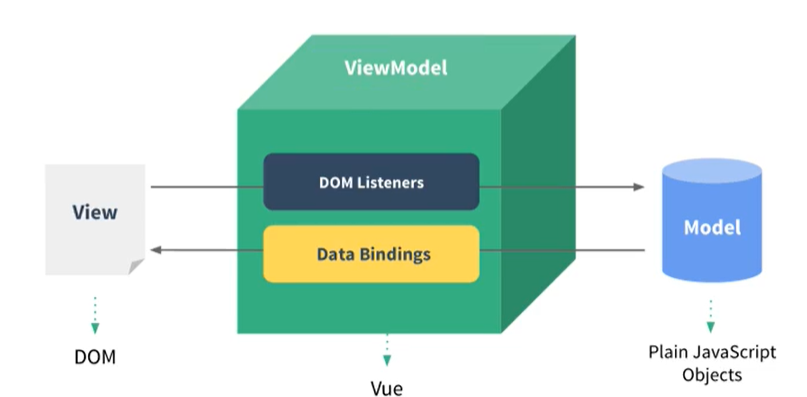

MVVM模型:
        M:模型(Model)对应data中的数据
        V:视图(View)模板代码
        VM:视图模型(ViewModel)Vue实例对象

el有两种写法:
        (1)new Vue时候直接传递el属性    ---     常用
        (2)通过app.$mount('#app')指定容器       ---     不常用
data有两种写法:
        (1)对象式:非组件化编码时可以写对象,也可以写函数
        (2)函数式:组件化编码必须使用函数式的data

Vue最重要的原则:
        由Vue调用的函数，都不要写成箭头函数，this就不对了（或许是undefined。或许是window）